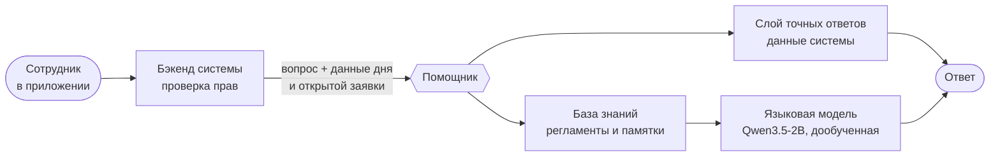

# ИИ-помощник выездного инженера

> Спокойный, точный и всегда доступный напарник в кармане у каждого сотрудника:
> знает его день, объясняет решения планировщика и подсказывает, как правильно делать работу.

Помощник встроен в систему планирования выездных работ и общается с сотрудниками
в чате на обычном русском языке. Им пользуются все участники процесса — выездные
инженеры, бригадиры и диспетчеры, — и каждый получает ответы в пределах своих прав
и своих задач.

---

## Что он делает

**Знает рабочий день сотрудника.** Смена, заявки на сегодня в порядке маршрута,
текущая заявка и следующая, время визита и окно клиента, адрес с подъездом и этажом,
статус, нужное оборудование, заметки диспетчера и коллег — помощник отвечает на всё
это мгновенно и по живым данным системы.

**Объясняет решения планировщика.** Когда план пересчитывается — пришла авария,
коллега стал недоступен, клиент попросил другое время, — помощник рассказывает
человеческим языком, что изменилось в заявке и почему. Перестановки перестают быть
неожиданностью, а сотрудник понимает логику системы.

**Вводит в работу новичков.** Помощник подсказывает, как пользоваться приложением:
какую кнопку нажать на каждом этапе, как закрыть заявку, что делать, если клиента нет
дома или не хватает оборудования, куда обратиться, если вопрос вне его компетенции.

**Хранит опыт компании.** Регламенты по видам работ — авария на ТКД, подключение
клиента, ремонт у клиента, дозаказ оборудования — с нормативами времени, порядком
действий, правилами безопасности и тем, что указать при закрытии заявки.

**Уважает роли.** Исполнитель видит только свои заявки, бригадир — заявки своей
бригады, диспетчер — всё. Справка тоже разделена: каждый получает памятку своей роли.

---

## Как он устроен

### Два источника знания

| | Слой точных ответов | База знаний и языковая модель |
| --- | --- | --- |
| **О чём** | Смена, заявки, время, адреса, статусы, оборудование, причины переносов | Работа в системе, правила ролей, порядок действий, регламенты по видам работ |
| **Откуда** | Данные системы планирования в реальном времени | Справочник компании в Markdown, разделённый по ролям и видам работ |
| **Как отвечает** | Собирает ответ напрямую из данных, мгновенно | Находит нужные разделы справки и формулирует ответ на их основе |
| **Главное свойство** | Время, числа и причины всегда совпадают с системой | Ответы опираются на регламенты, со ссылкой на раздел справки |

Сначала помощник определяет, о чём вопрос. Всё, что касается данных сотрудника,
отвечается слоем точных ответов: он берёт сведения из «Моего дня» исполнителя и истории
изменений заявки и складывает их в понятную фразу. Составные вопросы разбираются по
частям, и на каждую часть приходит свой ответ.

Вопросы о правилах и порядке работы уходят в базу знаний. Поиск с учётом русской
морфологии находит подходящие разделы — с приоритетом для памятки по виду работ открытой
заявки — и языковая модель отвечает, опираясь только на них и на данные сотрудника.
Если ответа нет ни в данных, ни в справке, помощник честно говорит об этом и подсказывает,
к кому обратиться.

### Обучение под задачи сервиса

Языковая модель не взята «как есть»: она дообучена под этот сервис. Для неё подготовлены
сотни примеров ответов по базе знаний — для исполнителя, бригадира и диспетчера,
с правильными кнопками, правами ролей и честным «не знаю» там, где справка молчит, — а
вопросы о рабочем дне собраны на данных, повторяющих структуру реальной выгрузки. На этих
примерах модель дообучена методом LoRA: она отвечает коротко, по регламентам и в пределах
прав собеседника.

Дообучение выполнено целиком на ноутбуке — MacBook с чипом Apple M1 Pro и 16 ГБ памяти —
с помощью фреймворка Apple MLX. Qwen3.5 устроена гибридно: часть слоёв использует
линейное внимание, и стандартный способ обучения таких слоёв требует десятки гигабайт
памяти. Для проекта реализован собственный блочный расчёт этих слоёв, точно совпадающий
с исходным, — он позволил обучать модель в пределах 4 ГБ. Готовая модель переводится
в формат GGUF и работает в Ollama так же, как стандартная.

### Безопасность и приватность

- **Всё работает внутри контура.** Языковая модель запускается локально через Ollama:
  данные заявок, адреса клиентов и сведения о сотрудниках никуда не передаются,
  интернет не нужен.
- **Права проверяет бэкенд.** Помощник получает только те данные, которые сотрудник
  и так имеет право видеть.
- **Никакой истории на сервере.** Помощник не хранит переписку: контекст беседы
  приходит вместе с вопросом.

### Архитектура

- **Отдельный сервис** на Python и FastAPI в собственном контейнере; бэкенд обращается
  к нему через единую точку входа чата.
- **Языковая модель** Qwen3.5-2B, дообученная под сервис, в Ollama: работает на обычном процессоре, а на машине
  с видеокартой NVIDIA включается ускорение одной строкой конфигурации.
- **База знаний** — набор Markdown-файлов: новая памятка или регламент подключаются
  без изменения кода, достаточно положить файл.
- **Запуск** — одной командой `docker compose` вместе со всей системой; модель
  скачивается автоматически при первом старте.

---

## Где найти

- Код помощника: [`assistant/`](../assistant)
- База знаний: [`assistant/knowledge/`](../assistant/knowledge)
- Технические материалы проекта: [`Артефакты_нейронки/`](../Артефакты_нейронки)
